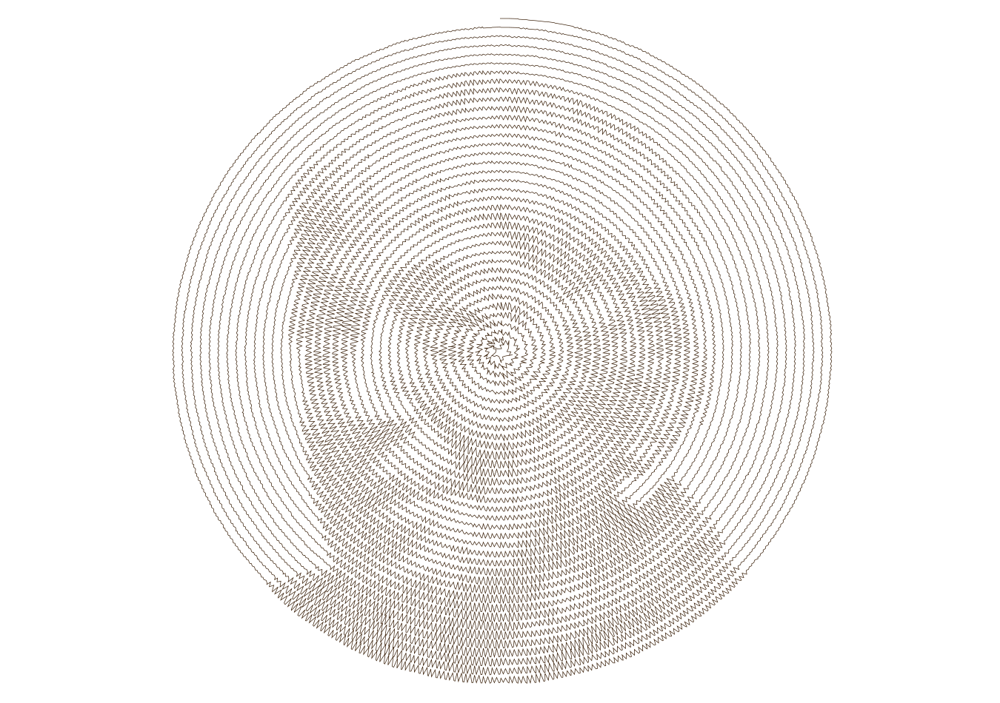

# photo-squiggle-plot
_Photos rendered in squiggly lines, for the Feb-2020 Plotter Postcard Exchange #PTPX_

  
_* Portrait  of Ursula K Le Guin on a spiral line with squiggles_

This is the code I used to create the postcards sent out in Paul Butler's ([@paulgb](https://twitter.com/paulgb)) February 2021 Plotter Postcard Exchange [#ptpx](https://twitter.com/search?q=%23ptpx).

All of this is built from scratch: I was interested in figuring out the entire process, from the trigonometry of putting squiggles on a spiral to using SVG fonts and generating a plottable SVG. None of the code is pretty, but that's not the point; my focus was on the thing, not on the software ;-)

I don't have access to a plotter, but I do have access to a laser cutter, so I used that as a "plotter" to draw on paper at a low power setting. It's all vector cutting, not bitmap etching! With the laser cutter there is no choice of pens. In exchange, the plotted line is very thin, which allows for a fine plot with densely packed lines.

The plotter-friendly font I used for the back of the cards comes from [gitlab.com/oskay/svg-fonts](https://gitlab.com/oskay/svg-fonts). It is licensed under the [SIL Open Font License](https://scripts.sil.org/cms/scripts/page.php?site_id=nrsi&id=OFL).

The code is built on .NET Core 3.1. You can run it on any system after installing the framework. It is more of a script than a command line tool: look at `Program.Main()` to get started. The working directory must be the repository's root.
